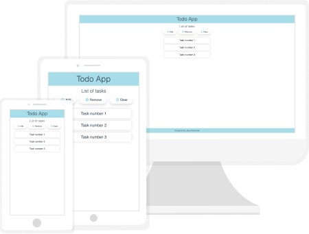

# Simple Todo App

> Simple Todo App made for recruiting purposes.

## Table of contents
* [Technologies](#technologies)
* [Setup](#setup)
* [Features](#features)
* [Preview](#preview)
* [Status](#status)
* [Contact](#contact)

## Technologies
* HTML5
* CSS3
* JavaScript ES6
* Visual Studio Code with Live Server and Live Sass Compiler

## Setup
If you want to run my website locally, clone this repository

`git clone https://github.com/jakub-matusiak/todo-app-simple`

or just copy files on your computer.

## Features
List of features:
* adding numbered tasks
* removing last task
* clearing all tasks
* storing tasks in local storage

## Preview
To live preview of my project visit this website: [Simple Todo App](https://jakub-matusiak.github.io/todo-app-simple/)

## Status
Project is _completed_. Made for _recruiting purposes_ only.

## Contact
Created by [Jakub Matusiak](https://github.com/jakub-matusiak) - feel free to contact me!